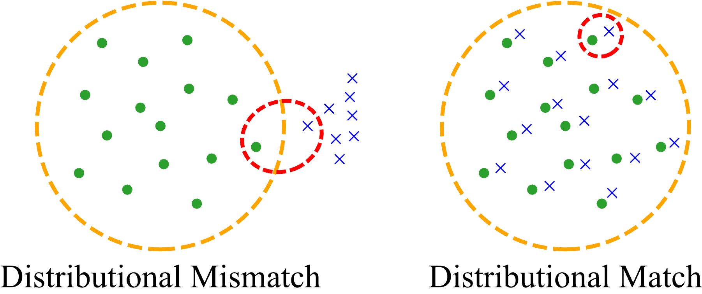
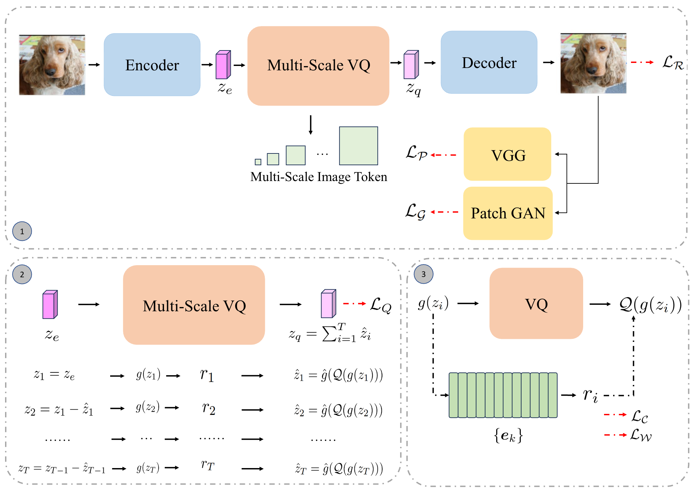

# Vector Quantization by Distribution Matching

## Overview

<p align="center"></p>

Vector quantization (VQ) is crucial for effective autoregressive models, especially in visual generative tasks. However, training instability and codebook collapse often limit VQ's full potential. These issues arise due to a mismatch between the feature and code vector distributions, leading to suboptimal utilization of the codebook and significant quantization errors. In this work, we propose a novel approach to **Vector Quantization by Distribution Matching**, which aligns the feature and code vector distributions using the **Wasserstein distance**, achieving near 100% codebook utilization and significantly reducing quantization error.

Our method introduces a distributional perspective on VQ, analyzing how better alignment of feature and codebook distributions leads to improved stability and performance. Extensive experiments demonstrate that this approach mitigates training instability and codebook collapse, enhancing downstream tasks like image reconstruction. Our overall framework is as follows:

<p align="center"></p>

## Setup

To install and run the code, set up the environment as follows:

```bash
conda env create -f environment.yml
conda activate vq_distribution_matching
python -m pip install -e .
```

## Implementation

Once the environment is set up, you can run the training process using the provided shell scripts. Here’s an example of how to run the training for the Wasserstein quantizer:

```bash 
bash train_wasserstein_quantizer_part1.sh
bash train_wasserstein_quantizer_part2.sh
```

These scripts will train the model using the Wasserstein distance for vector quantization on your selected dataset. The training outputs, including checkpoints, will be stored in the specified directories.

## Evaluation

For evaluating the model, use the provided shell scripts. Specifically, you can run the reconstruction evaluation by executing:

```bash
bash eval_reconstruction_part1.sh
```

## Results

| Method              | Codebook Size | Utilization (%) | rFID ↓ | LPIPS ↓ | PSNR ↑ | SSIM ↑ |
|---------------------|---------------|-----------------|--------|---------|--------|--------|
| VQGAN (Baseline)    | 16,384        | 83.2            | 3.41   | 0.14    | 23.5   | 56.6   |
| **Wasserstein VQ**  | 16,384        | **100.0**       | **2.28** | **0.12** | **24.43** | **63.5** |

## Acknowledgements

This work builds upon prior research on **vector quantization** and **autoregressive modeling**. We gratefully acknowledge the resources and inspiration from the following repositories:

- [VQGAN](https://github.com/CompVis/taming-transformers)
- [DALL-E](https://github.com/openai/DALL-E)